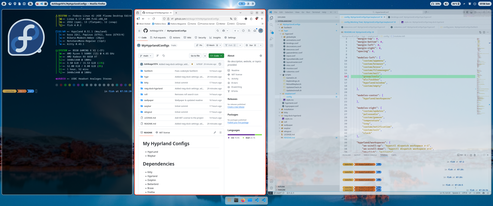
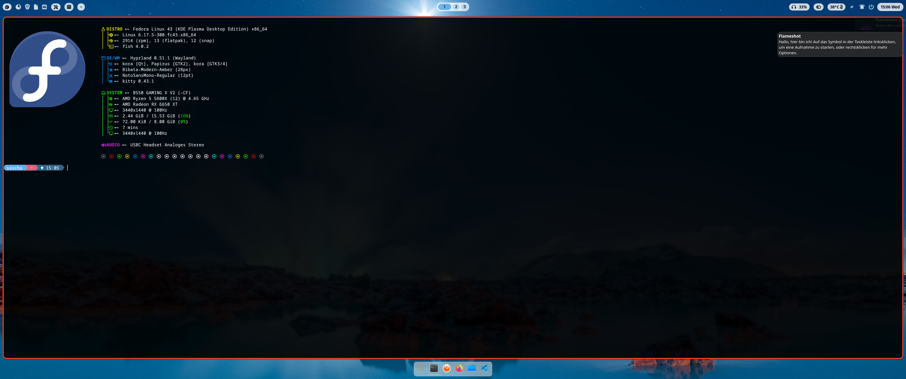

# My Hyprland Configs

Hyprland settings and desktop tools for Fedora 42 or newer!

Fedora 42


Fedora 43

## WHY?

I created my own dotfiles for Hyprland 🧩 because other solutions often
felt too complicated ⚙️. Many pre-made configs include far too many
options, making the system confusing and hard to manage 🌀. They also
hide unexpected pitfalls that cause trouble when customizing or updating
⚠️. With my own dotfiles, I keep full control 🖋️, know exactly how
everything works 🧠, and can fine-tune my setup to match my needs
perfectly 🎯.

I’d like to share my dotfiles with other users too 🤝, so they can
benefit from them 💡 and set up their own hyprland environment more
easily 🚀.

With the installation guide below, even beginners with moderate
experience can set it up easily 🛠️✨ — no advanced skills required! 🚀

## Installation

*The installation section will follow soon – Work in progress!*

1. Install git:

   ```
   sudo dnf install git
   ```
2. Create a new folder in your home directory and navigate into it:

   ```
   mkdir hyprlandconfig
   cd hyprlandconfig
   ```
3. Clone the repository:

   ```
   git clone https://github.com/Ashikaga1974/MyHyprlandConfigs.git
   ```
4. Go to the installation subdirectory and run the script:

   ```
   cd MyHyprLandConfigs/install
   ./install.sh
   ```

## Dependencies

During setup, the required dependencies and packages will be installed
automatically ⚙️✨, so you don’t have to worry about missing anything
📦🚀.For a complete setup, you need the following packages:

- hyprland
- hyprlock
- hyprpaper
- waybar
- kitty
- dolphin
- flatpak
- firefox
- nwg-dock-hyprland
- SwayNotificationCenter
- rofi
- wlogout
- fastfetch
- flameshot
- brave-browser
- material-icons-fonts
- fira-code-fonts
- jetbrains-mono-fonts
- mozilla-fira*
- bibata-cursor-themes
- fish
- oh-my-posh
- xdotool (optional)
- betterbird (optional)

## Credits

Special thanks to everyone who provided inspiration and support:

- [ML4W](https://www.ml4w.com/)
- [JaKooLit](https://github.com/JaKooLit/Hyprland-Dots/)

## Wallpaper

Wallpaper thanks to Derek Taylor ([DT](https://gitlab.com/dwt1)).

## THX!

If you like my work [buy me a coffee!](https://buymeacoffee.com/saschalerst)
